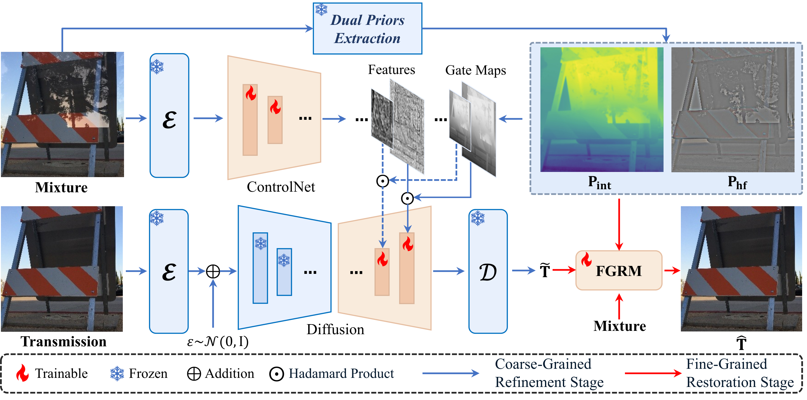

<div align="center">

# FUMO: Prior-Modulated Diffusion for Single Image Reflection Removal

**Telang Xu<sup>1,&#42;</sup>, Chaoyang Zhang<sup>2,3,&#42;</sup>, Guangtao Zhai<sup>1</sup>, Xiaohong Liu<sup>1,2,&dagger;</sup>**

<sup>1</sup> Shanghai Jiao Tong University  
<sup>2</sup> Shanghai Innovation Institute  
<sup>3</sup> Xi'an Jiaotong University

<sup>&#42;</sup>Equal contribution  <sup>&dagger;</sup>Corresponding author 

[](TODO) [](https://arxiv.org/abs/2603.19036) [](TODO)

</div>

---

## Timeline

- `[2026-03-19]` arXiv submission.
- `[2026-03-22]` Code repository released.
- `[TODO]` Model weights released.

## Abstract

FUMO is a coarse-to-fine framework for single image reflection removal. It combines a VLM-based reflection intensity prior and a wavelet high-frequency prior to modulate diffusion restoration in the coarse stage, followed by a refinement network for structural consistency and artifact suppression.

## Framework

<!-- TODO: replace the placeholder path with your real figure path -->
<p align="center">
  
</p>

## Visual Results

<!-- TODO: replace the placeholder path with your real qualitative result figure path -->
<p align="center">
  
</p>

## Repository Structure

```text
FUMO/
  train_diffusion.py                         # Stage-1 training (coarse diffusion)
  train_refine_cosine.py                     # Stage-2 training (refinement)
  batch_folder_infer.py                      # Batch inference
  wavelet_color_fix.py
  requirements.txt                           # Main model environment
  Qwen2.5-VL/
    requirements.txt                         # VLM prior environment
    Qwen2.5-VL-main/
      batch_generate_heatmaps_from_dir.py    # Prior generation
  diffusion/
  basicsr/
  utils/
```

## Installation

### Main model environment

```bash
pip install -r requirements.txt
```

### VLM prior environment

```bash
pip install -r Qwen2.5-VL/requirements.txt
```

## Data Format

Training scripts use JSONL metadata. Each line should contain:

```json
{
  "conditioning_image": "/path/to/input.png",
  "image": "/path/to/gt.png",
  "prior": "/path/to/prior.npy",
  "text": "remove glass reflection"
}
```

Field definitions:
- `conditioning_image`: reflected input image
- `image`: clean ground truth image
- `prior`: intensity map (`.npy`)
- `text`: text prompt

Dataset source:
- Nature
- Real
- RR4k
- RRW
- DRR
- Synthetic

## Training

### Stage 1: Coarse diffusion training

```bash
python train_diffusion.py \
  --pretrained_model_name_or_path /path/to/base_model \
  --train_data_dir /path/to/train_jsonl_dir \
  --multiple_datasets train_a.jsonl train_b.jsonl \
  --multiple_datasets_probabilities 0.5 0.5 \
  --output_dir /path/to/diffusion_output \
  --validation_jsonl /path/to/val.jsonl \
  --resolution 768 \
  --train_batch_size 1 \
  --learning_rate 5e-5 \
  --num_train_epochs 1 \
  --gradient_accumulation_steps 1 \
  --checkpointing_steps 500
```

### Stage 2: Refinement training

```bash
python train_refine_cosine.py \
  --pretrained_model_name_or_path /path/to/base_model \
  --train_data_dir /path/to/train_jsonl_dir \
  --multiple_datasets train_a.jsonl train_b.jsonl \
  --multiple_datasets_probabilities 0.5 0.5 \
  --controlnet_dir /path/to/diffusion_output/controlnet \
  --unet_dir /path/to/diffusion_output/unet \
  --output_dir /path/to/refine_output \
  --resolution 768 \
  --resize_scale 1.1 \
  --batch_size 1 \
  --num_workers 4 \
  --epochs 10 \
  --learning_rate 1e-4 \
  --min_learning_rate 1e-4 \
  --lr_warmup_steps 0 \
  --weight_decay 1e-4 \
  --gradient_accumulation_steps 1 \
  --beta 0.25
```

## Inference

### Step 1: Generate Qwen2.5-VL priors

Set `INPUT_DIR`, `MODEL_PATH`, and `OUTPUT_DIRNAME_SUFFIX` in:
- `Qwen2.5-VL/Qwen2.5-VL-main/batch_generate_heatmaps_from_dir.py`

Then run:

```bash
cd Qwen2.5-VL/Qwen2.5-VL-main
python batch_generate_heatmaps_from_dir.py
```

### Step 2: Run coarse + refine inference

```bash
python batch_folder_infer.py \
  --pretrained_model_name_or_path /path/to/base_model \
  --controlnet_dir /path/to/diffusion_output/controlnet \
  --unet_dir /path/to/diffusion_output/unet \
  --refine_net_path /path/to/refine_output/nafnet_refine_final.pth \
  --refine_head_path /path/to/refine_output/nafnet_refine_head_final.pth \
  --input_mode folder \
  --blended_dir /path/to/blended \
  --prior_dir /path/to/prior \
  --output_dir /path/to/output \
  --prompt "remove glass reflection" \
  --beta 0.25 \
  --max_size 1024 \
```

Outputs:
- `*_diff.png`: coarse output
- `*_refine.png`: refined output

## Pretrained Weights

- Diffusion checkpoint: `TODO`
- Refine checkpoint: `TODO`
- Qwen2.5-VL checkpoint: `TODO`

Checkpoint directory layout:

```text
TODO
```

## Citation

```bibtex
@article{fumo2026,
  title   = {Prior-Modulated Diffusion for Single Image Reflection Removal},
  author  = {Xu, Telang and Zhang, Chaoyang and Zhai, Guangtao and Liu, Xiaohong},
  journal = {TODO},
  year    = {2026}
}
```

## License

This project is released under the Apache-2.0 License. See `LICENSE` for details.

## Acknowledgements

This project builds on open-source components including Diffusers, BasicSR, and Qwen2.5-VL. Please follow their corresponding licenses when reusing related modules.
